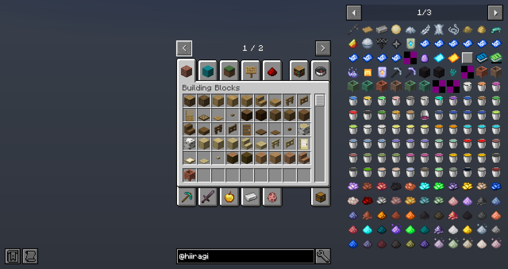
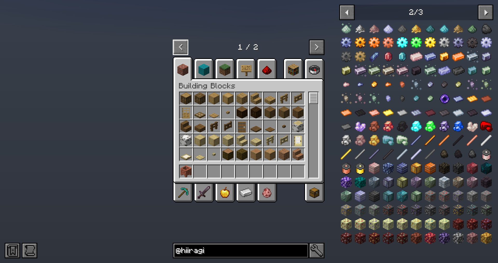
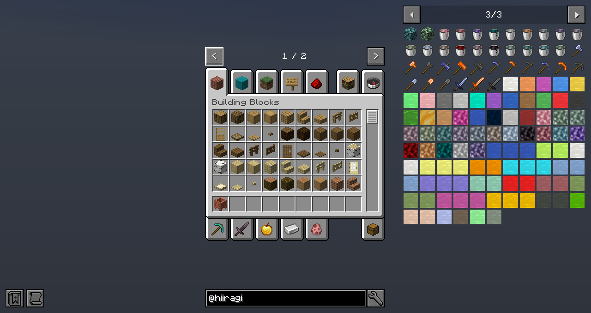
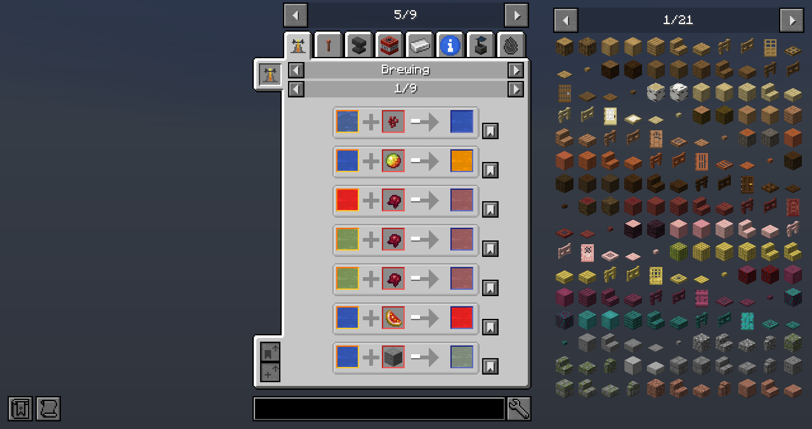
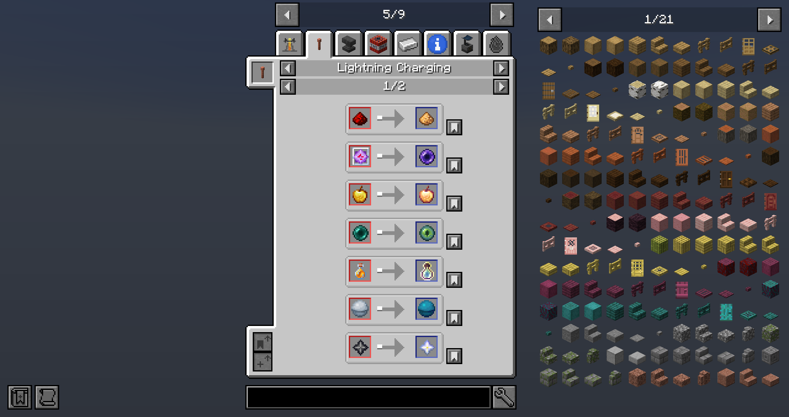
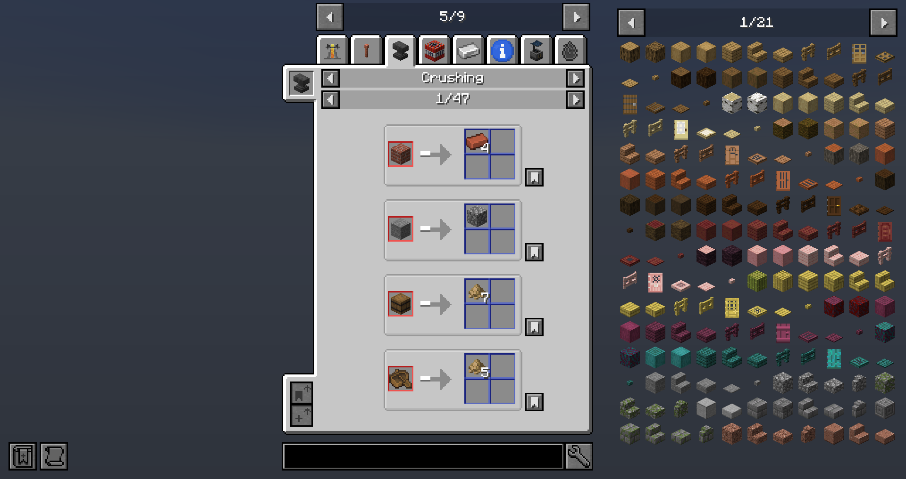
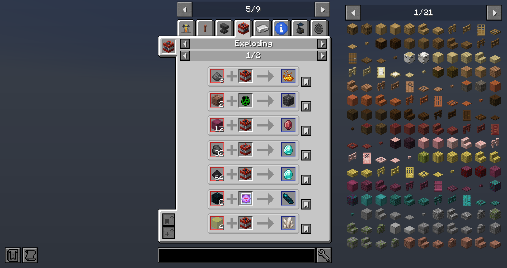
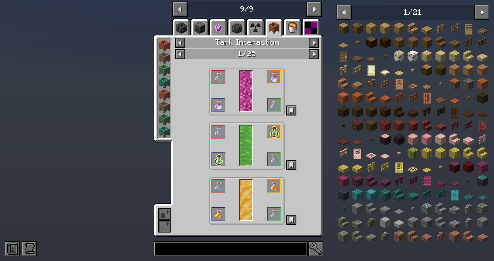

# Hiiragi Core

[](https://github.com/Hiiragi283/hiiragi-core)
[](https://www.curseforge.com/minecraft/mc-mods/hiiragi-core)
[](https://modrinth.com/mod/hiiragi-core)

## About

- A library mod for Hiiragi's mods
- Supported mod loader: 🦊NeoForge
- Supported mc version: 🔒MC1.21.1

## Feature

- Material Blocks/Items
  - 🌳Vanilla
    - 🔥Fuels: Coal, Charcoal
    - 🧱Minerals: (Redstone), (Glowstone)
    - 💎Gems: Lapis, Quartz, Amethyst, Diamond, Emerald, Echo, Prismarine
    - 🔮Pearls: Ender
    - ⛓Metals: Iron, Copper, Gold
    - 🔩Alloys: Netherite
    - 🧪Others: Wood, Glass, (Stone), Obsidian, (Blaze), (Breeze), Brick, Nether Brick
  - 🌲Common
    - 🔥Fuels: Coal Coke
    - 🧱Minerals: Salt, Saltpeter, Bauxite, Sulfur, Cinnabar, Galena
    - 💎Gems: (Fluorite), (Peridot), (Ruby), (Sapphire)
    - ⛓Metals
      - 2nd Period: (Lithium), (Beryllium)
      - 3rd Period: (Sodium), (Magnesium), Aluminum, (Silicon)
      - 4th Period: (Titanium), (Vanadium), (Chromium), (Manganese), (Cobalt), (Nickel), Zinc
      - 5th Period: (Molybdenum), Ruthenium, Rhodium, Palladium, Silver, Tin, (Antimony)
      - 6th Period: (Tungsten), Osmium, Iridium, Platinum, Lead
      - 7th Period: (Uranium), (Plutonium)
    - 🔩Alloys: Steel, (Invar), Brass, (Constantan), Bronze, (Electrum), (Signalum), (Lumium), (Enderium)
    - 🧪Others: Ash, Carbon, Plastic, Rubber
  - 🔧Original
    - 💎Gems: Azure, Crimson Crystal, Warped Crystal
    - 🔮Pearls: Eldritch
    - 🔩Alloys: Azure Steel
  - (`Material`): No contents added by Hiiragi Core

- Blocks
  - 🥛Warped Wart: A blue wart which clears one bad effect randomly when eaten.
  - 🍂Tree Tap: Extracts Latex from attached logs to below cauldron
  - 🧺Copper Basin: A fluid storage which stored 4B of fluid and fill/empty containers manually
- Fluids
  - 🌈Liquid Dyes, 🧩Experience, 🍯Honey, 🍄Mushroom Stew, ✨Dragon Breath, ⚗Potion, and so on...
- Items
  - 🔥Bamboo Charcoal: A organic fuel made from Bamboo
  - 💣Bomb: Throwable explosive
  - 📦Particle Board: An alternative planks made from Sawdust
  - 🧪Synthetic Feather/Fiber/Leather: A alternatives for Feather/String/Leather made from Plastic
  - 🥚Eldritch Egg: A purple egg which captures mobs, not only Pig but also Warden!
  - 📘Trader's Catalog: Opens trading menu of Wandering Trader
  - 📗Experience Tome: Store your experience or release it
- End-Game Items
  - 🦾Almighty Pickaxe: A mining tool suitable for ALL BLOCKS
  - 🤔Ambrosia: A food with MAXIMUM SATURATION and NOT CONSUMED
  - 🌌Eternal Smithing Template: A smithing template which make any equipment UNBREAKABLE
- Recipe Types
  - ⚡Charging: Fired when Lightning Strike hit on item entity
  - ⚠Crushing: Fired when Anvil fallen on item entity
  - 💥Exploding: Fired when explosion hit on item entity
  - 🔨Forging: Fired when right-clicking Forging Anvil with Hammer
  - 💧Tank Interaction: Fired when right-clicking with container item to Copper Basin

## Images

### Contents





### Recipes







## Maven

### Groovy

[](https://search.maven.org/artifact/io.github.hiiragi283/hiiragi-core)


```groovy
repositories {
    // Maven Central
    mavenCentral()
    // Modrinth Maven
    maven {
        url = "https://api.modrinth.com/maven"
        content {
            includeGroup "maven.modrinth"
        }
    }
}

dependencies {
    // Maven Central
    implementation "io.github.hiiragi283:hiiragi-core:VERSION"
    // Modrinth Maven
    implementation "maven.modrinth:hiiragi-core:VERSION"
}
```

### Kotlin

```kotlin
repositories {
    // Maven Central
    mavenCentral()
    // Modrinth Maven
    maven(url = "https://api.modrinth.com/maven") {
        content { 
            includeGroup("maven.modrinth")
        }
    }
}

dependencies {
    // Maven Central
    implementation("io.github.hiiragi283:hiiragi-core:VERSION")
    // Modrinth Maven
    implementation("maven.modrinth:hiiragi-core:VERSION")
}
```
